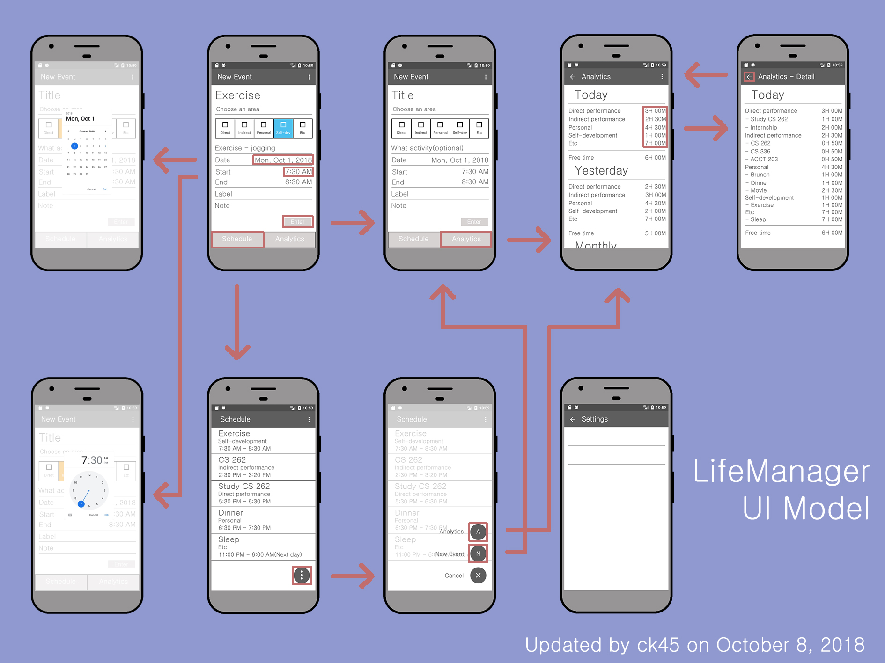
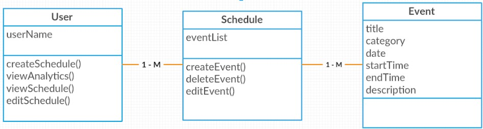

## Vision Statement:

LifeManager is an application that enables its users to keep track of daily activities and review their day by tracking their time. With our application, users will be able to analyze the way they spend their time in order to find ways to better manage their time. In addition to the basic time tracking feature, LifeManager will give users the chance to set goals and time limits for desired activities. Imagine a world of college students easily tracking, reviewing and adjusting their time to effectively live a more balanced life. All of this, simply possible with a push of a button!

What makes LifeManager different is the simplicity of it. We aim to make it quick to use and easy to read and understand how your time is spent. Our app will remove complex number displays and unnecessary button pushing to program certain specific wants.

As an example, you will be able to see, total time spent per day/week/month/year, what time of day one usually starts on a certain action and what an average day of the week looks like (this would be specific to each day of the week). Help make your life a little more manageable with LifeManager.

## UI Model

## Domain Model

## Deployment Diagram

## Usability Test

## Supplemental Specification:
    - A user should be able to learn our app in less than 5 minutes.
    - The application will be written in Java.
    - The application will be built using Android Studio.
    - The application should be testable to determine if it does what it should do.
    - The application should run without crashing.
    - The application should respond to requests in 1 to 3 seconds.
    - All Android users should be able to use our application.
    
## Presentations
First Presentation
https://docs.google.com/presentation/d/12QEjSSwGGOJTPdq2CIrPrGzo5RlYBHKgmiaFyLaucjA/edit?usp=sharing

Final Presentation
https://docs.google.com/presentation/d/1P0RS4svbd4ElH5-il3M0UaPtKRfCnYdB0GEgEvWSjTU/edit?usp=sharing
